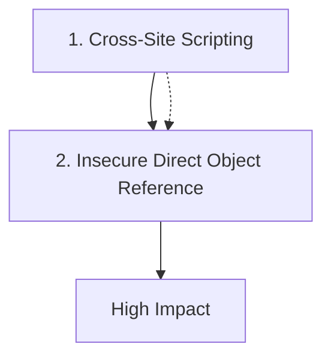

================================================================================
ATTACK CHAIN SECURITY REPORT
================================================================================

Title: Example Attack Chain
Report Date: 2025-12-31
Severity: 
Impact: High

================================================================================

================================================================================
EXECUTIVE SUMMARY
================================================================================

Title: Example Attack Chain
Severity: 
Impact Level: High
Date: 2025-12-31

Overview:
  An example attack chain for testing report generation

Attack Chain Summary:
  This attack chain consists of 2 steps that can be
  chained together to achieve high impact.

Key Steps:
  1. Cross-Site Scripting: XSS in profile...
  2. Insecure Direct Object Reference: IDOR in admin panel...

Business Impact:
  High impact - Significant data or system access possible

Recommendation:
  Immediate remediation is recommended. Please review the full technical
  report for detailed steps and mitigation strategies.

================================================================================

================================================================================
TECHNICAL SECURITY REPORT
================================================================================

Report Information:
  Title: Example Attack Chain
  Severity: 
  Impact: High
  Discovered: 2025-12-31
  Discovered By: Unknown
  Report Date: 2025-12-31

Description:
  An example attack chain for testing report generation

================================================================================
ATTACK CHAIN DETAILS
================================================================================

Step 1: Cross-Site Scripting
--------------------------------------------------------------------------------
Description: XSS in profile

Outcome: XSS stored

Step 2: Insecure Direct Object Reference
--------------------------------------------------------------------------------
Description: IDOR in admin panel

Prerequisites:
  - XSS stored

Outcome: Admin access

================================================================================
IMPACT ASSESSMENT
================================================================================

Overall Impact: High
Severity: 

Final Outcome: Admin access

================================================================================

================================================================================
ATTACK CHAIN VISUALIZATION
================================================================================

================================================================================
REMEDIATION RECOMMENDATIONS
================================================================================

Priority Actions:

1. Address Insecure Direct Object Reference:
   - Implement proper authorization checks
   - Use indirect object references
   - Validate user permissions for each resource access
   - Implement access control lists (ACL)

2. Address Cross-Site Scripting:
   - Implement Content Security Policy (CSP)
   - Sanitize all user input
   - Use output encoding for user-generated content
   - Implement XSS filters and validation

General Recommendations:
  - Conduct regular security assessments
  - Implement security monitoring and logging
  - Keep all software and dependencies updated
  - Follow secure coding practices
  - Implement defense in depth strategies

================================================================================

================================================================================
END OF REPORT
================================================================================